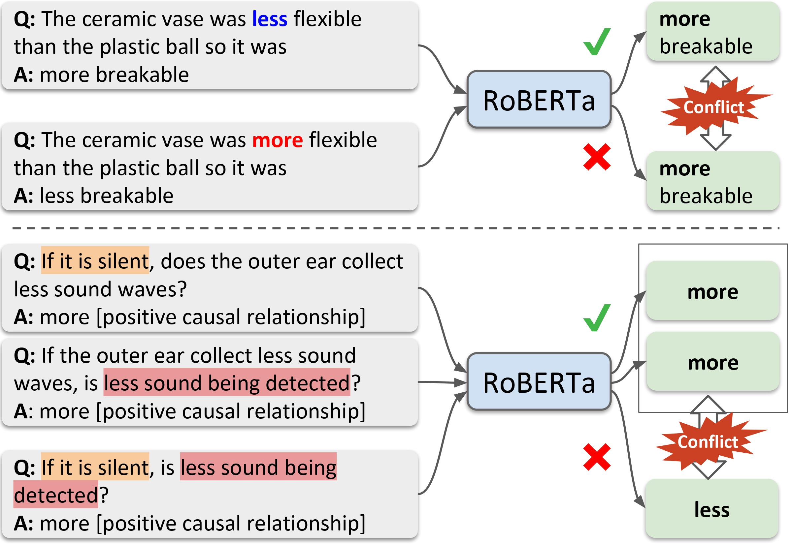

# Logic-Guided Data Augmentation and Regularization for Consistent Question Answering

This is the original implementation of the following paper.

Akari Asai and Hannaneh Hajishirzi. [Logic-Guided Data Augmentation and Regularization for Consistent Question Answering](https://arxiv.org/abs/2004.10157). In: Proceedings of ACL (short). 2020.

```
@inproceedings{asai2020logic,
  title={Logic-Guided Data Augmentation and Regularization for Consistent Question Answering},
  author={Asai, Akari and Hajishirzi, Hannaneh},
  booktitle={ACL},
  year={2020}
}
```
In the paper, we introduce logic-guided data augmentation and regularization to improve accuracy and consistency in a range of question answering datasets, namely [WIQA](https://allenai.org/data/wiqa), [QuaRel](https://allenai.org/data/quarel) and [HotpotQA (comparison)](https://hotpotqa.github.io/). 

<p align="center"></p>
